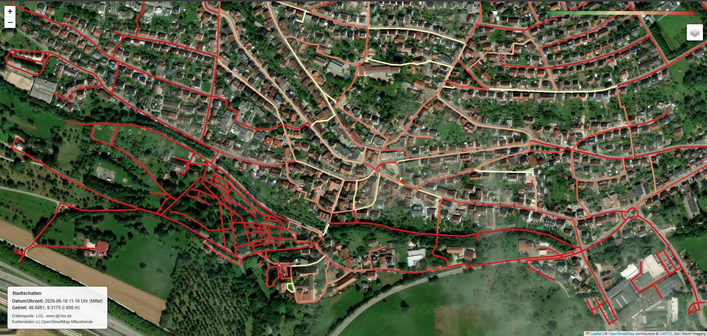
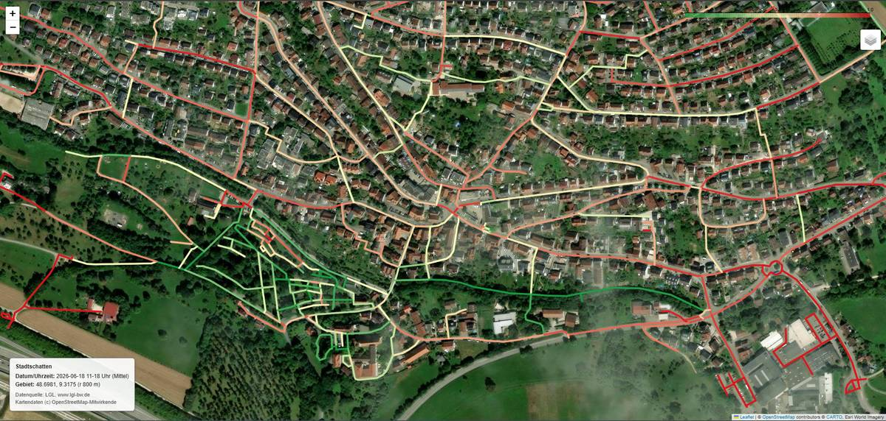

# Stadtschatten

Das Modul berechnet **Schatten von Gebäuden und Bäumen** und bestimmt daraus, welcher Anteil
des städtischen Fußwegenetzes in der Sonne bzw. im Schatten liegt – wahlweise zu einem einzelnen
Zeitpunkt oder **gemittelt über ein Stundenfenster** („Sonnendosis", z. B. 11–18 Uhr).

Daraus ergeben sich zwei Anwendungen:

- **Schattiger Fußweg:** der schattigste statt des schnellsten Weges zwischen zwei Punkten
  (gewichtetes Routing mit stufenlosem Umschalter).
- **Hitzeexpositions-Layer:** sichtbar machen, *wo entlang realer Laufwege* die Sonnenbelastung
  am höchsten ist – also wo Beschattung für Fußgänger am dringendsten gebraucht wird.

Stadtschatten teilt die OpenStreetMap-Datengrundlage mit dem Schwestermodul **Stadtgrün**,
ist aber eigenständig.

---

## Funktionsweise

```
1. Laden        Geh-Graph (osmnx) + Hindernisse mit Höhe              → modules/loader.py
                Gebäude (LGL-LoD2, OSM-Fallback) + Vegetation (nDOM)
2. Schatten     Schatten für einen Zeitpunkt (pybdshadow);            → modules/schatten.py
                optional über ein Stundenfenster gemittelt            → modules/kantenbewertung.py
3. Bewertung    Schatten den Wegekanten zuordnen, Sonnenanteil je     → modules/kantenbewertung.py
                Kante (einzeln oder gemittelt), Kantengewichtung
4. Routing      gewichteter kürzester Pfad, schnellster vs. schattigster → modules/routing.py
5. Ausgabe      Folium-Karten (Schatten-Check, Sonnenanteil, Route)
                jeweils mit Lauf-Parametern und Quellenangabe
```

Die Kantenbewertung tastet jede Wegekante in Stützpunkten ab und prüft mit *einem*
räumlichen Verschnitt gegen die vereinigte Schattenfläche, welcher Anteil jeder Kante
beschattet ist. Ergebnis pro Kante: `sonnenanteil` (0 = ganz im Schatten, 1 = volle Sonne)
sowie zwei Gewichte fürs Routing.

---

## Gebäudehöhen (Kern von v2)

Verlässliche Höhen sind die Voraussetzung für belastbare Schattenwerte. Die Höhe wird in
`modules/loader.py` als Fallback-Kette bestimmt:

```
1. LGL-LoD2 (amtlich, gemessen)   ← bevorzugt, innerhalb Baden-Württembergs
2. OSM height
3. OSM building:levels × 3 m
4. Default 6 m (2 Geschosse)
```

Liegen für das Suchgebiet LGL-LoD2-Kacheln vor, werden deren amtliche Footprints und
`measuredHeight` direkt verwendet (Modul `modules/lgl_lod2.py`); andernfalls greift der
OSM-Weg. Die LGL-Kacheln werden als CityGML-Dateien (`LoD2_*.gml`) im Ordner `data/`
erwartet und auf das aktuelle Suchgebiet zugeschnitten.

**Verifiziert am Testgebiet Esslingen (vier 1-km-Kacheln, 3.885 Gebäude):**
100 % Höhenabdeckung. Etwa 81 % tragen die Höhe am Gebäude selbst, die übrigen ~19 % auf
ihren Gebäudeteilen (`BuildingPart`) – beide werden ausgelesen. Zum Vergleich: über OSM
allein lagen für dasselbe Gebiet nur ~13–32 % echte Höhen vor, der Rest war geschätzt.

**Wichtige Einordnung:** `measuredHeight` ist die Höhe bis zum höchsten Punkt (Firsthöhe).
pybdshadow extrudiert flach bis dahin, wodurch der Schatten bei Steildächern leicht
überschätzt wird. Für die *relative* Routenwahl (schattig vs. sonnig) hebt sich das
weitgehend auf; nur der absolute Sonnenanteil ist minimal überschätzt.

---

## Zeit-Aggregation: Sonnendosis (v3)

Statt eines einzelnen Moments lässt sich der Sonnenanteil über ein Stundenfenster mitteln –
die „Sonnendosis" über den heißen Nachmittag. Pro Stunde wird der Schatten neu gerechnet,
je Kante der Sonnenanteil bestimmt und anschließend über die Stunden gemittelt
(`bewerte_kanten_aggregiert` in `modules/kantenbewertung.py`).

- Geschaltet über `AGG_AKTIV` in `config.py`; Fenster über `AGG_START_STUNDE`/`AGG_END_STUNDE`
  (beide Ränder **einschließlich**, stündlich, Standard 11–18 Uhr).
- Gilt **nur für den Hitzeexpositions-Layer**, nicht fürs Routing – ein „schattigster Weg
  über einen gemittelten Tag" wäre nicht sinnvoll.
- Die Info-Box der Karte zeigt das Fenster („11–18 Uhr (Mittel)") statt einer Einzeluhrzeit.
- `schatten_check.html` wird im Mittel-Modus **bewusst nicht** erzeugt: kein einzelnes
  Stundenbild repräsentiert den Durchschnitt ehrlich.

**Ehrliche Einordnung:** Das Fenster ist eine *Planer-Entscheidung*, kein Physik-Wert –
das Modell kennt nur den Sonnenstand, nicht die Lufttemperatur. Die Kosten sind ehrlich:
der Schatten wird N-mal gerechnet (acht Stunden = achtfacher Aufwand); bei kleinen
Gebieten unkritisch.

---

## Vegetation / Baumschatten (v3)

Gebäudeschatten allein unterschätzt die Beschattung systematisch – gerade entlang von
Grünzügen, Bachläufen und Alleen. Stadtschatten ergänzt deshalb **Baumschatten aus dem
amtlichen nDOM1** (normalisiertes Oberflächenmodell, 1-m-Raster, Höhe über Boden) des
LGL Baden-Württemberg (`modules/vegetation.py`).

Da das nDOM nur Höhe kennt, nicht „Baum" vs. „Haus", entsteht Vegetation durch
**Maskierung mit den LoD2-Gebäuden**:

```
1. nDOM-Kacheln laden und zum Mosaik fügen          (data/<ort>/, ndom1_*.tif)
2. LGL-LoD2-Footprints (gepuffert) im nDOM abschalten → Gebäude raus
3. Schwelle: Pixel ≥ VEG_MIN_HOEHE gelten als Vegetation
4. zusammenhängende Flächen → Polygone, Höhe = Median der nDOM-Pixel darin
5. Flächenfilter gegen Pixel-Krümel (Laternen, Autos, Kanten)
```

Das Ergebnis ist ein `GeoDataFrame[geometry, height]` – **gleiches Format wie die Gebäude**.
Beide werden zusammengeführt und durch dieselbe Schatten- und Aggregationskette geschickt.
Die Baumschatten wandern damit automatisch mit der Sonne durch das Stundenfenster.

Drei an echten Daten kalibrierte Schalter (`config.py`):

| Parameter | Bedeutung | Standard |
|---|---|---|
| `VEG_MIN_HOEHE` | ab welcher Höhe etwas als schattenwerfend zählt | `3.0` m |
| `GEB_PUFFER_M` | Gebäude-Footprints aufpuffern, damit Wand-Pixel an der Hauskante nicht als Vegetation durchrutschen | `1.0` m |
| `VEG_MIN_FLAECHE_M2` | Mindestfläche je Vegetationspolygon (Rauschfilter) | `4.0` m² |

Die Vegetation ist über `VEG_AKTIV` abschaltbar (Vergleich Gebäude-nur vs. mit Bäumen,
oder Gebiete außerhalb BW). Eine **laute Abdeckungsprüfung** (`NDOM_ERFORDERLICH = True`)
stoppt mit klarer Meldung, falls die Kacheln das Suchgebiet nicht vollständig abdecken –
analog zu `LGL_ERFORDERLICH`, damit keine halb-abgedeckte Karte unbemerkt entsteht.

**Wichtiger Modell-Vorbehalt:** Ein Baum wird – wie ein Gebäude – als **massiver Block**
extrudiert. Reale Kronen sind porös, Licht fällt durch. Der Baumschatten ist damit eine
**Obergrenze**, kein exakter Wert. Für eine „hier ist Schatten"-Karte ist das vertretbar
und deutlich näher an der Realität als gar keine Bäume; die physikalisch rigorose
Behandlung (Transmissivität der Krone) bleibt UMEP/SOLWEIG vorbehalten (siehe *Grenzen*).

---

## Installation & Nutzung

```bash
# eigene Umgebung (empfohlen – getrennt von anderen Modulen)
python -m venv .venv
.\.venv\Scripts\Activate.ps1        # Windows PowerShell
# source .venv/bin/activate          # Linux/macOS
pip install -r requirements.txt

# kompletter Durchlauf
python run.py
```

Ergebnisse landen als HTML-Karten im Ordner `output/`. Einzelne Module lassen sich
auch separat starten (z. B. `python modules/schatten.py`).

### Konfiguration (`config.py`)

| Parameter | Bedeutung |
|---|---|
| `PLACE` | Ort (ganzer Ort), OSM-kompatibel |
| `ZENTRUM`, `RADIUS_M` | optionaler Zuschnitt auf einen Kreis (schnell, zum Entwickeln); `ZENTRUM = None` → ganzer `PLACE`. Bestimmt zugleich, welche LGL-/nDOM-Kacheln verwendet werden. |
| `DATUM`, `UHRZEIT`, `ZEITZONE` | Zeitpunkt des Schattenwurfs (Einzelmoment) |
| `AGG_AKTIV` | `True` → Hitzeexpositions-Layer wird über das Stundenfenster gemittelt; `UHRZEIT` gilt dann nur noch für `schatten_check.html` |
| `AGG_START_STUNDE`, `AGG_END_STUNDE` | Stundenfenster der Aggregation, beide Ränder einschließlich (Standard 11–18) |
| `VEG_AKTIV` | `True` → Baumschatten aus nDOM einbeziehen; `False` → nur Gebäudeschatten |
| `NDOM_KACHEL_UNTERORDNER` | Unterordner in `data/` mit den nDOM-Kacheln (`ndom1_*.tif`) |
| `VEG_MIN_HOEHE`, `GEB_PUFFER_M`, `VEG_MIN_FLAECHE_M2` | Vegetations-Schalter (siehe Abschnitt *Vegetation*) |
| `START`, `ZIEL` | Routing-Punkte als `(lat, lon)`; `None` → Route abgeschaltet bzw. Demo-Diagonale |
| `ALPHA_SCHATTIG` | Stärke der Schattenbevorzugung (siehe unten) |

LGL-LoD2-Kacheln liegen als `LoD2_*.gml`, nDOM-Kacheln als `ndom1_*.tif` im Ordner
`data/<ort>/`.

### Der `ALPHA`-Regler

Die Kantengewichtung lautet:

```
gewicht = laenge * (1 + ALPHA * sonnenanteil)
```

`ALPHA` ist der **Wechselkurs zwischen Umweg und Sonne**: wie viele zusätzliche Meter
in Kauf genommen werden, um einen Meter Sonne zu vermeiden.

- `ALPHA = 0` → schnellster Weg (Schatten egal)
- `ALPHA = 3` → ein Sonnenmeter „kostet" wie 4 Meter Gehen
- höher → stärkere Schattenbevorzugung, größere Umwege

Wichtig: `ALPHA` wirkt nur, wo es schattige Alternativen *gibt*. Über offene Plätze,
Brücken oder freie Geraden existiert kein Schatten – diese Abschnitte bleiben sonnig,
unabhängig von `ALPHA`. Jenseits des Punktes einer Strecke an dem der schattige
Umweg billiger wird als die sonnige Direktroute, ändert ein höheres `ALPHA` nichts mehr.

---

## Datengrundlage & Technik

| Zweck | Quelle / Werkzeug |
|---|---|
| Wegenetz, Gebäude-Footprints (Fallback) | OpenStreetMap via `osmnx` |
| Gebäudehöhen | **LGL-LoD2** (`measuredHeight`, amtlich) innerhalb BW · **Fallback:** OSM (`height`, `building:levels`, Default 2 Geschosse) |
| Baumhöhen / Vegetation | **LGL-nDOM1** (normalisiertes Oberflächenmodell, 1 m), Gebäude per LoD2 maskiert |
| Schatten / Sonnenstand | `pybdshadow` |
| CityGML einlesen | eigener Parser `modules/lgl_lod2.py` (ElementTree + `shapely`) |
| Raster (nDOM) einlesen | `rasterio`, `scipy.ndimage` (`modules/vegetation.py`) |
| Geometrie | `geopandas`, `shapely` |
| Graph / Routing | `networkx` |
| Karten | `folium` |

**Koordinatensystem:** EPSG:25832 (ETRS89/UTM32N) für alle metrischen Berechnungen –
identisch mit dem CRS der LGL-Daten (LoD2 *und* nDOM), daher kein Umprojizieren nötig.

---

## Stand (v3)

| Schritt | Status |
|---|---|
| pybdshadow verifiziert | ✅ |
| Loader: Geh-Graph + Gebäude mit Höhe | ✅ |
| Schatten-Wrapper (pybdshadow) | ✅ |
| Schatten-zu-Kante-Zuordnung + Kantengewichtung | ✅ |
| Routing: schnellster vs. schattigster Weg (Umschalter) | ✅ |
| Folium-Kartenausgabe mit Parametern + Quellenangabe | ✅ |
| Einstiegspunkt `run.py` | ✅ |
| Echte Gebäudehöhen via LGL-LoD2 (ersetzt OSM-Schätzung in BW) | ✅ |
| **Zeit-Aggregation / Sonnendosis (Stundenfenster, gemittelt)** | ✅ |
| **Baumschatten via nDOM (LoD2-Maskierung, kalibrierte Schalter)** | ✅ |
| Wege = Bürgersteig statt Straßenachse (Schattenseiten-Sampling) | ⬜ offen |
| Kachel-Auswahl je Gebiet + Höhen-Cache (Skalierung) | ⬜ offen |
| GPX-Export | ⬜ optional, offen |

---

## Validierung

Schattenrichtung und -länge werden gegen den berechneten Sonnenstand geprüft: Beispiel
Esslingen am Neckar, 21.06., Sonne im SSW bei hoher Sonnenhöhe → Schatten zeigen nach NNO;
Schattenlänge konsistent zur Gebäudehöhe und zum physikalischen Sonnenstand.

Geprüft an zwei Orten (Esslingen, Denkendorf). Mit der LGL-LoD2-Anbindung beruhen die
Höhen im Testgebiet Esslingen zu 100 % auf amtlichen Messwerten (Median ~11 m) statt auf
Schätzung – die absoluten Schattenwerte sind damit erstmals belastbar.

**Baumschatten (Denkendorf, Ortskenntnis als Maßstab):** Über das Fenster 11–18 Uhr steigt
der beschattete Netzanteil mit Vegetation auf ~31 % (gegenüber ~6 % ohne Bäume im selben
Fenster). Der zusätzliche Schatten folgt sichtbar dem Grünzug entlang des Bachlaufs – genau
dort, wo vor Ort die meisten Bäume stehen. Die nDOM-Höhen steigen über den Nachmittag
plausibel an (kurze Schatten zur Mittagszeit, lange am Abend), konsistent zum Sonnenstand.

Der direkte Vergleich am Bachlauf macht den Effekt sichtbar: Ohne Vegetation erscheint der
Grünzug fälschlich sonnig (rot); erst mit Baumschatten färbt sich dieselbe Strecke schattig
(grün). Beide Karten zeigen dasselbe Fenster (11–18 Uhr, gemittelt).

| Ohne Baumschatten (~6 % beschattet) | Mit Baumschatten (~31 % beschattet) |
|---|---|
|  |  |

---

## Grenzen dieser Auswertung

Bewusste, dokumentierte Einschränkungen:

1. **Wege = Straßenachsen, nicht Bürgersteige.** Der osmnx-`walk`-Graph nutzt die
   Straßenachse, wo Gehwege nicht als eigene Geometrie kartiert sind. Fußgänger laufen
   am Gebäuderand (schattiger) statt in der Straßenmitte. Der Fußgänger-Schatten wird
   dadurch eher **unter- als überschätzt** – die realen Werte liegen tendenziell über den
   ausgewiesenen.
2. **Baumschatten ist eine Obergrenze.** Bäume werden als massive Blöcke extrudiert; die
   Porosität der Krone (durchfallendes Licht) ist nicht modelliert. Der Vegetations-Schatten
   ist daher tendenziell zu dicht. Brauchbar für „wo ist überhaupt Schatten", nicht für
   exakte Bestrahlungsstärke.
3. **Höhen nur in Baden-Württemberg amtlich.** Innerhalb BW (und wo Kacheln vorliegen)
   kommen gemessene LGL-LoD2- und nDOM-Höhen zum Einsatz. Außerhalb BW oder ohne Kachel
   greift die OSM-Schätzung bzw. entfällt die Vegetation. `measuredHeight` ist Firsthöhe
   (siehe Abschnitt *Gebäudehöhen*).
4. **Stundenraster.** Die Aggregation arbeitet in vollen Stunden; das Fenster ist eine
   Planer-Entscheidung, kein temperaturbasierter Physik-Wert.
5. **Keine thermische Strahlungsmodellierung.** Bewusste Abgrenzung zu wissenschaftlich
   rigorosen Werkzeugen wie UMEP/SOLWEIG, die DSM-basiert rechnen und Kronen-Transmissivität
   sowie mittlere Strahlungstemperatur abbilden. Stadtschatten ist der schlanke, scriptbare,
   vollständig nachvollziehbare Weg – nicht das physikalisch vollständigste Modell.

---

## Ausblick

- **Frequenz × Sonnenbelastung:** Stark begangene *und* stark besonnte Wege als
  Prioritätskarte für Beschattungsmaßnahmen – der eigentliche planerische Hebel. Ansätze:
  Betweenness-Zentralität (strukturell) oder zielorientiertes Routing (zu Schulen,
  Bahnhof, Busbahnhof). Bleibt ein Modell, keine gemessene Frequenz.
- **Schattenseiten-Sampling:** Stützpunkte seitlich von der Achse versetzen und die
  schattigere Straßenseite werten – bildet reales Fußgängerverhalten ab (adressiert Grenze 1).
- **Kachel-Auswahl je Gebiet + Höhen-Cache:** damit über die Testgebiete hinaus skalierbar
  und ohne wiederholtes Parsen der großen CityGML-/Raster-Kacheln.
- **GPX-Export** der gewählten Route (für Navigation unterwegs).
- **Kronen-Transmissivität** als optionaler Premium-Pfad (SOLWEIG-Anbindung), wenn echte
  thermische Komfortanalyse gefragt ist.
- Weitere Städte.

---

## Datenlizenz

OpenStreetMap-Daten © OpenStreetMap-Mitwirkende (ODbL).

Diese Auswertung nutzt amtliche Geobasisdaten des Landesamts für Geoinformation und
Landentwicklung Baden-Württemberg (LGL): 3D-Gebäudemodelle (LoD2) und das normalisierte
Oberflächenmodell (nDOM1). Datenlizenz Deutschland – Namensnennung 2.0, Quellenangabe:
**„Datenquelle: LGL, www.lgl-bw.de"**. Die Angabe erscheint in der README sowie auf jeder
erzeugten Karte.